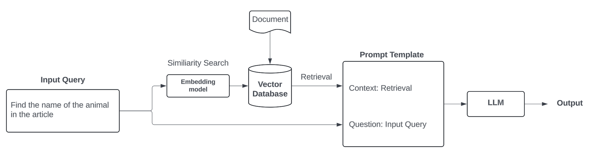

# RAG Project Frontend

<!-- import image from img/diagram.png -->

This project is a frontend interface for a Retrieval-Augmented Generation (RAG) system. Users enter a namespace, upload PDFs, and ask questions to interact with a backend powered by FastAPI and Pinecone.

## Next plans
- Implement database where userID, password, and namespace are stored
- Implement authentication
- Implement metadata filtering

## Backend
- FastAPI
- Pinecone (Vector database)
- LangChain for RAG pipeline

## Frontend
- Next.js (App Router)
- Shadcn/ui

## Instructions with docker:
- Get your openAI API, Pinecone API, and Langchain API keys
- Write .env file and locate it in backend directory
- Run the below command
- Once you run the below command, you can remove build flag
```bash
docker-compose up --build
```

## Instructions without using docker:
- Get your openAI API, Pinecone API, and Langchain API keys
- Write .env file and locate it in backend directory
- Install next.js 14 and install frontend dependencies
- Install python requirements `backend/requirements.txt`
- write .env file under backend folder
- run run.sh

## Frontend dependencies
```bash
npx create-next-app@14.2.16
npx shadcn@latest init
npx shadcn@latest add button
npx shadcn@latest add card
npx shadcn@latest add input
```

## .env template
```env
OPENAI_API_KEY= your_openai_api_key
LANGCHAIN_TRACING_V2=true
LANGCHAIN_ENDPOINT=https://api.smith.langchain.com
LANGCHAIN_API_KEY=your_langchain_api_key
LANGCHAIN_PROJECT=project_name
PINECONE_API_KEY=your_pinecone_api_key
PINECONE_REGION=your_pinecone_region
PINECONE_CLOUD=your_pinecone_cloud
```

## Note
- Use next.js 14.2.16
- The latest Next.js 15 conflicts with other axios and shadcn dependencies. You can't dockerize with Next.js 15.
- when install next.js, don't use eslint. 